# Анализ Успеваемости Студентов

Проект по анализу данных студентов для понимания того, какие факторы влияют на их академические результаты.

---

Проект был сделан Войт Елизаветой, студенткой AlmaU.

---

## О проекте

Анализируем датасет из 1000 студентов, чтобы понять:

- Влияет ли подготовительный курс на оценки?
- Как связано образование родителей с успеваемостью?
- Есть ли гендерные различия?
- Насколько важен социально-экономический статус?

По итогам получаем конкретные цифры и статистически проверяем все гипотезы.

---

## Датасет

Файл `StudentsPerformance.csv` — 1000 записей, 8 переменных:

| Переменная        | Описание                                            |
| --------------------------- | ----------------------------------------------------------- |
| gender                      | Пол студента                                     |
| race/ethnicity              | Этническая группа (A-E)                     |
| parental level of education | Образование родителей                   |
| lunch                       | Тип питания (standard / free-reduced)             |
| test preparation course     | Прошёл ли подготовительный курс |
| math score                  | Оценка по математике (0-100)              |
| reading score               | Оценка по чтению (0-100)                      |
| writing score               | Оценка по письму (0-100)                      |

---

## Бизнес-задачи и методы решения

| Вопрос                                                                                   | Метод решения                                                             |
| ---------------------------------------------------------------------------------------------- | ------------------------------------------------------------------------------------- |
| Как пол влияет на оценки?                                                  | Группировка по полу → средние → bar chart → t-test         |
| Какова связь образования родителей и успеваемости? | Группировка → упорядочивание → bar chart → ANOVA          |
| Насколько эффективен подготовительный курс?             | Разделение на 2 группы → boxplot → t-test                         |
| Как СЭС влияет на результаты?                                          | Анализ по типу питания → boxplot → t-test                        |
| Какое сочетание факторов лучше?                                     | Двойная группировка → комплексный bar chart             |
| Кто в группе риска?                                                             | Комбинация СЭС + подготовка → сравнение 4 групп |

---

## Результаты анализа

### Общая картина: распределение оценок

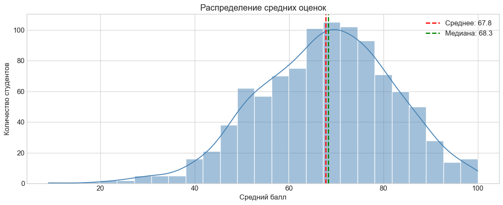

Распределение средних оценок близко к нормальному, слегка смещено вправо. Большинство студентов показывают результаты выше среднего (около 67 баллов).

---

### Вопрос 1: Гендерные различия

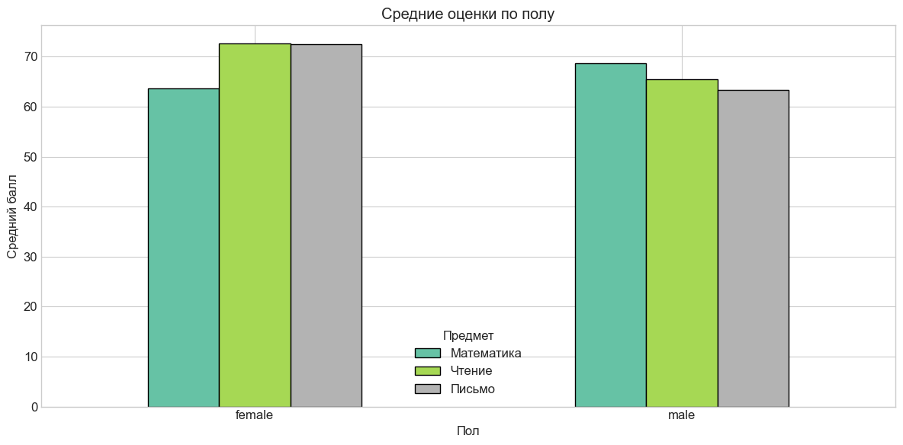

**Результат:**

- Парни лучше в математике на **5.1 баллов**
- Девушки лучше в чтении на **7.1 баллов**

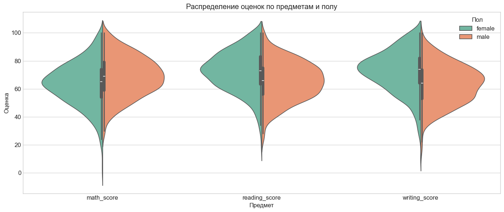

Violin plot показывает не только средние, но и форму распределения. Видно, что у девушек распределение в чтении и письме смещено к более высоким оценкам.

---

### Вопрос 2: Образование родителей

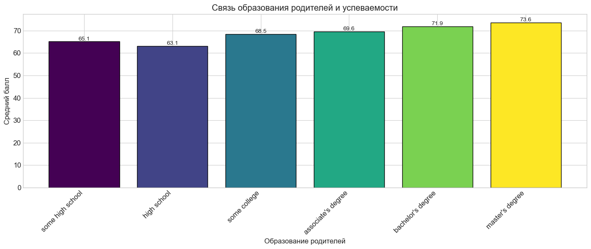

**Результат:** Чёткая положительная связь — чем выше образование родителей, тем лучше успеваемость детей.

Разница между высшим (master's degree) и неоконченным средним (some high school) образованием родителей: **+8.5 баллов**

ANOVA подтверждает статистическую значимость: F = 10.753, p < 0.001

---

### Вопрос 3: Эффективность подготовительного курса

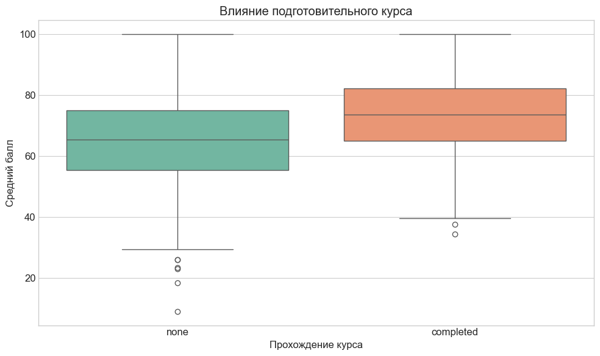

**Результат:**

- Без курса: 65.0 баллов
- С курсом: 72.7 баллов
- **Разница: +7.6 баллов**

T-test подтверждает: t = 8.391, p < 0.001 — различие статистически значимо.

---

### Вопрос 4: Социально-экономический статус

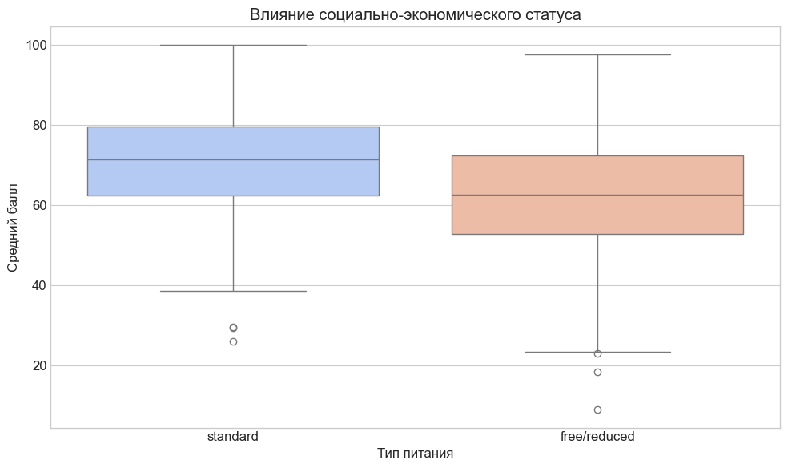

Тип питания выступает как индикатор достатка семьи:

- `standard` — семья оплачивает питание сама
- `free/reduced` — льготное питание (семья получает помощь)

**Результат:**

- Стандартное питание: 70.8 баллов
- Бесплатное/льготное: 62.2 балла
- **Разрыв: 8.6 баллов**

T-test: t = 9.575, p < 0.001 — разница значима.

---

### Вопрос 5: Комбинация факторов

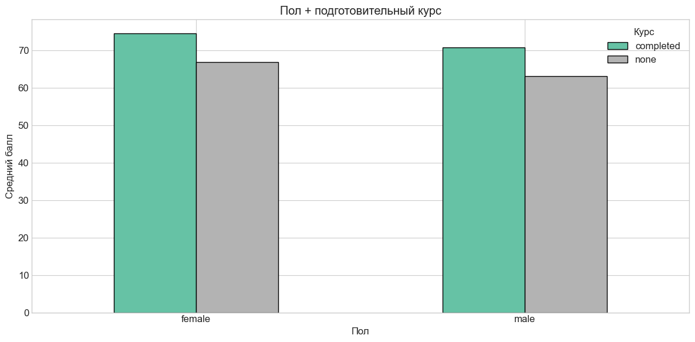

Подготовительный курс эффективен для обоих полов. Наилучшие результаты показывают девушки, прошедшие курс.

---

### Вопрос 6: Группы риска

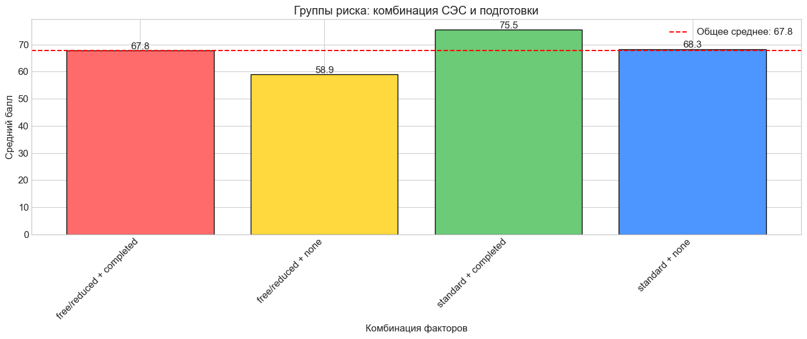

**Группа риска:** студенты с льготным питанием БЕЗ подготовительного курса

**Лидеры:** студенты со стандартным питанием И подготовительным курсом

Разница между этими группами — около **17 баллов**.

---

### Дополнительные визуализации

**Распределение по уровням успеваемости:**

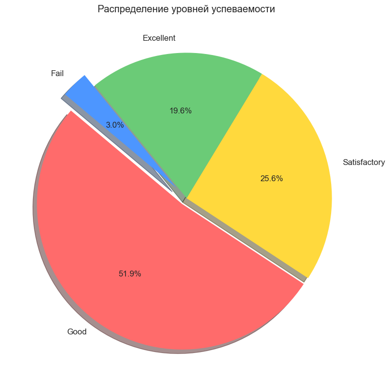

В группе риска (Fail): **3.0%** студентов

**Успеваемость по этническим группам:**

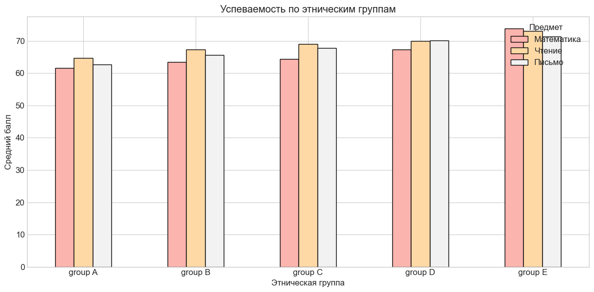

Группа E показывает наивысшие результаты по всем предметам.

**Корреляционная матрица:**

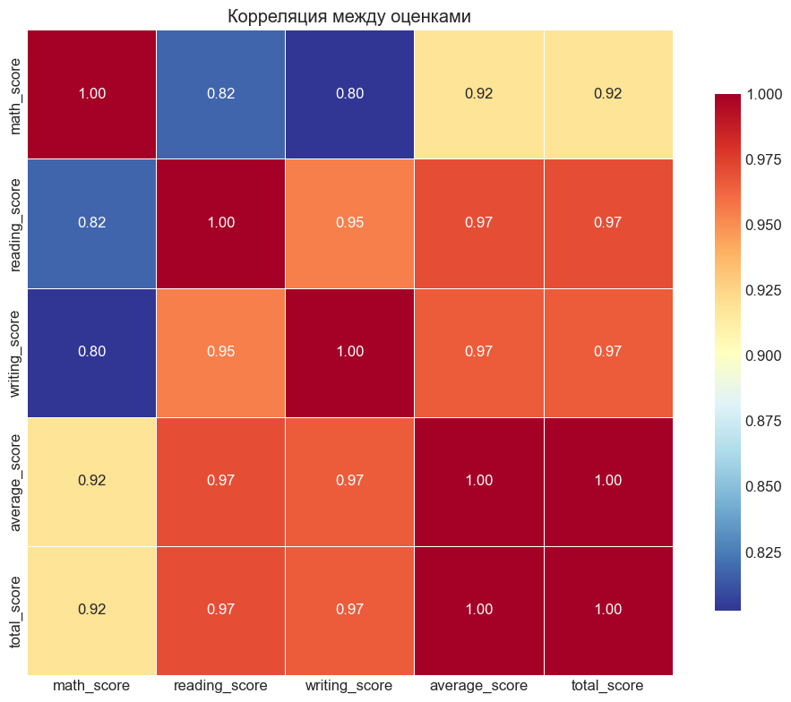

Чтение и письмо имеют очень высокую корреляцию (>0.95) — это связанные навыки.

**Доля сдавших экзамены по категориям:**

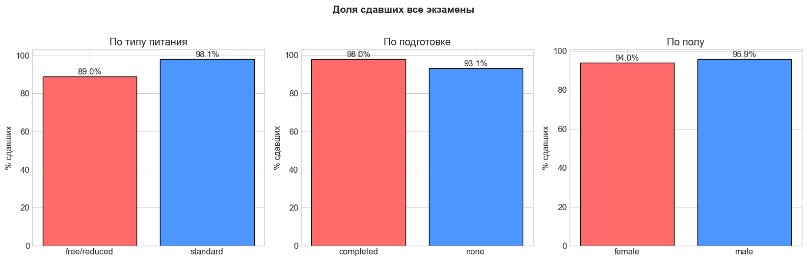

---

## Итоговая таблица результатов

| Фактор                              | Эффект (баллы) | Статистически значимо? |
| ----------------------------------------- | ------------------------- | ------------------------------------------ |
| Подготовительный курс | +7.6                      | Да (p<0.001)                             |
| СЭС (тип питания)            | +8.6                      | Да (p<0.001)                             |
| Образование родителей | +8.5                      | Да (p<0.001)                             |
| Гендер (математика)       | +5.1                      | Да (p<0.05)                              |
| Гендер (чтение)               | +7.1                      | Да (p<0.05)                              |

---

## Выводы

1. **Подготовительные курсы реально работают** — студенты с курсом набирают в среднем на 7-8 баллов выше. Это статистически значимый результат.
2. **Социально-экономический статус критичен** — разница в ~10 баллов между группами. Тип питания здесь выступает как индикатор достатка семьи.
3. **Образование родителей транслируется детям** — чёткая положительная связь между уровнем образования родителей и оценками детей.
4. **Гендерные различия есть, но предсказуемы** — парни чуть лучше в математике, девушки в гуманитарных предметах.

---

## Рекомендации

1. **Расширить доступ к подготовительным курсам** — особенно для студентов из группы риска (ROI около +7 баллов)
2. **Целевая поддержка малообеспеченных студентов** — дополнительные занятия, менторство
3. **Вовлечение родителей** — информирование о важности участия в образовательном процессе
4. **Персонализированный подход** — учитывать гендерные особенности при организации обучения

---

## Как запустить

```bash
# Клонируем репозиторий
git clone https://github.com/your-username/student-performance-analysis.git
cd student-performance-analysis

# Ставим зависимости
pip install pandas numpy matplotlib seaborn scipy jupyter

# Запускаем
jupyter notebook Student_Performance_Analysis.ipynb
```

---

## Структура проекта

```
student-performance-analysis/
├── Student_Performance_Analysis.ipynb  # Основной notebook
├── StudentsPerformance.csv             # Данные
├── CODE_DOCUMENTATION.md               # Подробное объяснение кода
├── README.md                           # Этот файл
└── images/                             # Графики результатов
    ├── distribution.png
    ├── gender_average.png
    ├── gender_grades.png
    ├── parents_education.png
    ├── preparation_course.png
    ├── social_status.png
    ├── correlation.png
    └── ...
```

---

## Документация кода

Подробное объяснение всех используемых функций и библиотек — в файле [CODE_DOCUMENTATION.md](CODE_DOCUMENTATION.md).

---

*Декабрь 2024*

